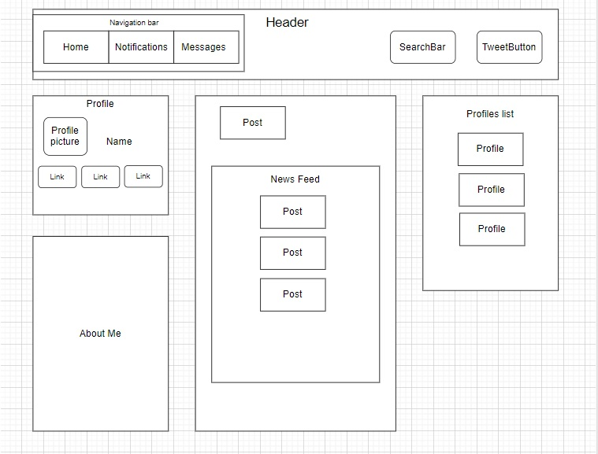

# Social Media Clone

#### By Asia Kaplanyan and Eliot Gronstal 4.17.23

#### _A site that looks like a mock-up of a social media page using only React components. Made for Epicodus Coding School Week 16: React Fundamentals. This is not a portfolio quality project and should not be considered portfolio-ready._

## Technologies Used

* _React_
* _JSX_
* _HTML/CSS_
* _JavaScript_
* _Node_

# Component Diagram

### Setup/Installation Requirements:

* First, copy the git repository url and open a shell program & navigate to your machine's desktop
* Clone the repository using the copied URL and the `git clone` command
* In the shell program, navigate to the root directory of the newly created file called "SocialMediaClone-1"
* Run the `npm install` command to install dependencies
* After the installation updates, in the root directory type `npm run start` to start the program
* If the web page doesn't open on its own, open a web browser (such as Google Chrome) and enter the following into the URL: `http://localhost:3000/`

## Available Scripts

In the project directory, you can run:

### `npm start`

Runs the app in the development mode.
Open [http://localhost:3000](http://localhost:3000) to view it in your browser.

The page will reload when you make changes.
You may also see any lint errors in the console.

### `npm run build`

Builds the app for production to the `build` folder.
It correctly bundles React in production mode and optimizes the build for the best performance.

The build is minified and the filenames include the hashes.
Your app is ready to be deployed!

See the section about [deployment](https://facebook.github.io/create-react-app/docs/deployment) for more information.

### `npm run eject`

**Note: this is a one-way operation. Once you `eject`, you can't go back!**

If you aren't satisfied with the build tool and configuration choices, you can `eject` at any time. This command will remove the single build dependency from your project.

Instead, it will copy all the configuration files and the transitive dependencies (webpack, Babel, ESLint, etc) right into your project so you have full control over them. All of the commands except `eject` will still work, but they will point to the copied scripts so you can tweak them. At this point you're on your own.

You don't have to ever use `eject`. The curated feature set is suitable for small and middle deployments, and you shouldn't feel obligated to use this feature. However we understand that this tool wouldn't be useful if you couldn't customize it when you are ready for it.

## Learn More

You can learn more in the [Create React App documentation](https://facebook.github.io/create-react-app/docs/getting-started).

To learn React, check out the [React documentation](https://reactjs.org/).

### Code Splitting

This section has moved here: [https://facebook.github.io/create-react-app/docs/code-splitting](https://facebook.github.io/create-react-app/docs/code-splitting)

### Analyzing the Bundle Size

This section has moved here: [https://facebook.github.io/create-react-app/docs/analyzing-the-bundle-size](https://facebook.github.io/create-react-app/docs/analyzing-the-bundle-size)

### Making a Progressive Web App

This section has moved here: [https://facebook.github.io/create-react-app/docs/making-a-progressive-web-app](https://facebook.github.io/create-react-app/docs/making-a-progressive-web-app)

### Advanced Configuration

This section has moved here: [https://facebook.github.io/create-react-app/docs/advanced-configuration](https://facebook.github.io/create-react-app/docs/advanced-configuration)

### Deployment

This section has moved here: [https://facebook.github.io/create-react-app/docs/deployment](https://facebook.github.io/create-react-app/docs/deployment)

### `npm run build` fails to minify

This section has moved here: [https://facebook.github.io/create-react-app/docs/troubleshooting#npm-run-build-fails-to-minify](https://facebook.github.io/create-react-app/docs/troubleshooting#npm-run-build-fails-to-minify)

## Known Bugs

* _Any known issues_

* _Please reach out with any questions or concerns [eliot.lauren@gmail.com](eliot.lauren@gmail.com), [a.kaplanyan@gmail.com](a.kaplanyan@gmail.com)

## License

_[MIT](https://opensource.org/license/mit/)_

Copyright (c) 2023 _Eliot Gronstal & Asia Kaplanyan_
